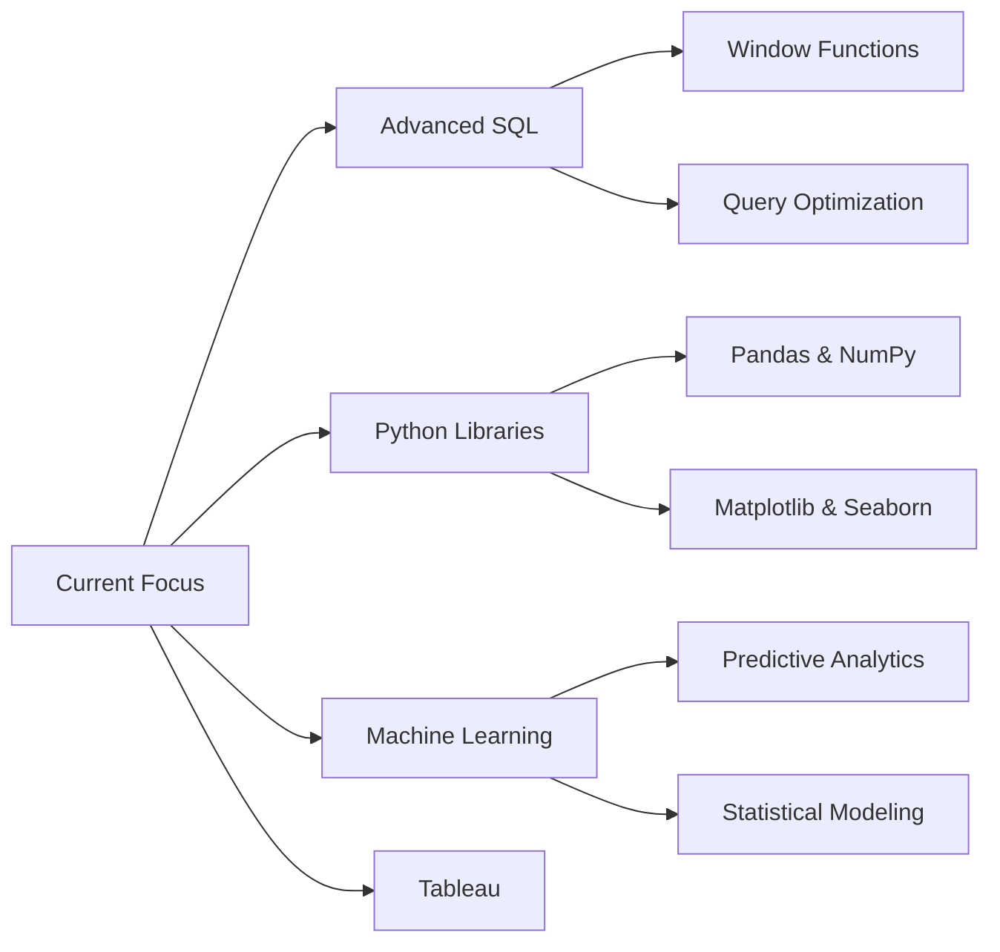

# Hi there, I'm Raajiv! 👋

<div align="center">
  
[](https://git.io/typing-svg)

</div>

<div align="center">
  
[](https://www.linkedin.com/in/raajiv28)
[](mailto:raajivraajiv28@gmail.com)
[](https://github.com/Raajiv-Analyst)

</div>

---

## 🚀 About Me

```python
class DataAnalyst:
    def __init__(self):
        self.name = "Raajiv"
        self.role = "Data Analyst | Business Analyst"
        self.location = "Ooty, Tamil Nadu, India"
        self.education = "Recent Graduate"
        self.passion = ["Data Analytics", "Business Intelligence", "Problem Solving"]
        
    def get_skills(self):
        return {
            "analytics": ["Data Analysis", "Statistical Analysis", "Trend Identification"],
            "business": ["Requirements Gathering", "Process Optimization", "Stakeholder Management"],
            "visualization": ["Dashboard Creation", "Interactive Reports", "Data Storytelling"],
            "approach": ["Data-Driven Decision Making", "Continuous Learning", "Agile Methodology"]
        }
```

I'm a passionate **Data Analyst** and **Business Analyst** who loves turning complex data into actionable insights. My mission is to bridge the gap between data and business strategy, helping organizations make informed decisions that drive growth.

---

## 🛠️ Technical Arsenal

<div align="center">

### 📊 Data & Analytics Tools


### 💼 Business & Productivity


### 📈 Core Competencies

</div>

```
📊 Data Analysis & Visualization  ███████████████████░  95%
💼 Business Requirements          ██████████████████░░  90%
🗄️ SQL & Database Management     ████████████████░░░░  85%
🐍 Python for Data Science       ███████████████░░░░░  80%
📉 Statistical Analysis           ██████████████░░░░░░  75%
🎯 Stakeholder Communication      ███████████████████░  95%
```

---

## 🎓 Professional Certifications

<div align="center">

| Certification | Provider | Year | Link |
|:-------------:|:--------:|:----:|:----:|
| **Business Analysis Foundations** | LinkedIn Learning | 2024 | [View →](https://lnkd.in/gmyg8Jzy) |
| **Data Analytics Certificate** | LinkedIn Learning | 2024 | [View →](https://lnkd.in/gSrMn54d) |
| **SQL for Data Analysis** | LinkedIn Learning | 2024 | [View →](https://lnkd.in/g2MfndT3) |
| **Power BI Essential Training** | LinkedIn Learning | 2024 | [View →](https://lnkd.in/gfEkFpuz) |
| **Excel Advanced Analytics** | LinkedIn Learning | 2024 | [View →](https://www.linkedin.com/learning/certificates/0dc670eb146a6732d2a575a592418af7b6c54cc2df3025bbd9d24da5ee38974e) |
| **Agile Methodology** | LinkedIn Learning | 2024 | [View →](https://www.linkedin.com/learning/certificates/61a7fb3ad797758e389f7856e8ce7602a999b114603be3949155a4ba7c43d0f9) |

</div>

---

## 💼 Featured Projects

### 📈 [Meta Business Performance Dashboard](https://app.powerbi.com/view?r=eyJrIjoiMDAzMGE5MjEtNjNjNC00ZWIxLThmMGMtMzcxODY1ODE1MDkwIiwidCI6ImY2Zjk3NDE3LTEwNjItNDYyZC05NzU3LTZjOTU4MzZmNDk3MSJ9)

<div align="center">


</div>

**Business Impact:**
- 📊 Comprehensive analysis of Meta's business metrics and KPIs
- 📈 Interactive Power BI dashboard with real-time insights
- 🔍 Data cleaning and transformation pipeline implementation
- 💡 Actionable recommendations leading to strategic decisions
- 📉 Trend analysis and predictive modeling

**Technical Highlights:**
- Processed and analyzed large datasets using Python (Pandas, NumPy)
- Designed interactive visualizations in Power BI
- Wrote complex SQL queries for data extraction
- Created automated reporting workflows in Excel

[🔗 **View Live Dashboard**](https://app.powerbi.com/view?r=eyJrIjoiMDAzMGE5MjEtNjNjNC00ZWIxLThmMGMtMzcxODY1ODE1MDkwIiwidCI6ImY2Zjk3NDE3LTEwNjItNDYyZC05NzU3LTZjOTU4MzZmNDk3MSJ9) | [📂 **Repository**](https://github.com/Raajiv-Analyst/Meta-Analysis)

---

## 📊 GitHub Analytics

<div align="center">
  


</div>

---

## 🎯 What I Bring to Your Team

<div align="center">

| 💡 **Problem Solving** | 📊 **Data-Driven** | 🤝 **Collaboration** | 📈 **Growth Mindset** |
|:---:|:---:|:---:|:---:|
| Analytical thinking to solve complex business challenges | Evidence-based decision making with actionable insights | Cross-functional teamwork and stakeholder management | Continuous learning and adaptability |

</div>

### 🔍 Areas of Expertise

- **Data Analysis:** Statistical analysis, trend identification, pattern recognition, data mining
- **Business Intelligence:** KPI development, dashboard creation, performance metrics, reporting automation
- **Requirements Analysis:** Stakeholder interviews, user stories, process mapping, gap analysis
- **Data Visualization:** Creating compelling narratives through Power BI, Excel, and Python libraries
- **Process Improvement:** Identifying inefficiencies, recommending solutions, implementing best practices

---

## 🌱 Currently Learning & Exploring



---

## 💼 Open to Opportunities

I'm actively seeking **Data Analyst** and **Business Analyst** roles where I can:

✅ Transform raw data into strategic business insights  
✅ Collaborate with stakeholders to drive data-driven decisions  
✅ Build interactive dashboards and reporting solutions  
✅ Optimize business processes through analytical thinking  
✅ Contribute to organizational growth and innovation  

---

## 📫 Let's Connect!

<div align="center">

I'm always excited to discuss data analytics, business intelligence, or potential collaboration opportunities!

[](https://www.linkedin.com/in/raajiv28)
[](mailto:raajivraajiv28@gmail.com)
[](https://github.com/Raajiv-Analyst)

### 💬 "Data is the new oil, but insights are the refined fuel that drives business success."

---


</div>

---

<div align="center">
  
**⭐ If you find my work interesting, consider giving my repositories a star!**

*Last Updated: January 2026*

</div>
